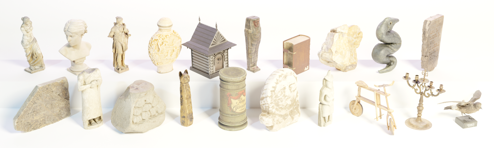

# Cultural-Heritage-Models
A collection of cultural heritage models designed for Benchmarking MVS Algorithms.

## Dataset Structure
There are in total 20 Models, all scaled to fit a cube of approximately 1x1x1 units (e.g. meters). Each model is located in a sub folder that contains the following data:

- <b>model.obj</b>: The model with UV coordinates that is used for rendering.
- <b>reference_model.ply</b>: The same model in ply format that is used as reference geometry
- <b>points.ply</b>: A point cloud of 1 million points that were sampled on the model
- <b>diffuse.png</b>: The diffuse texture
